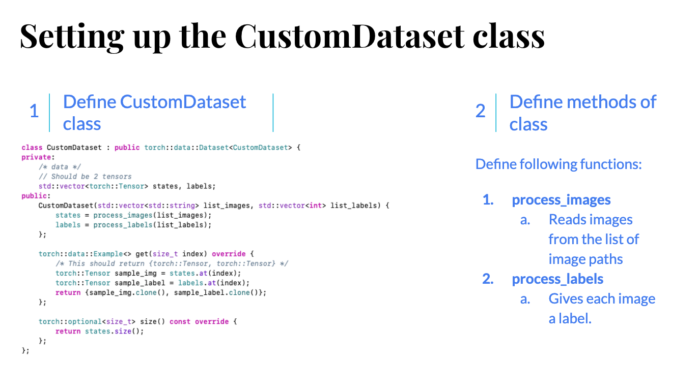
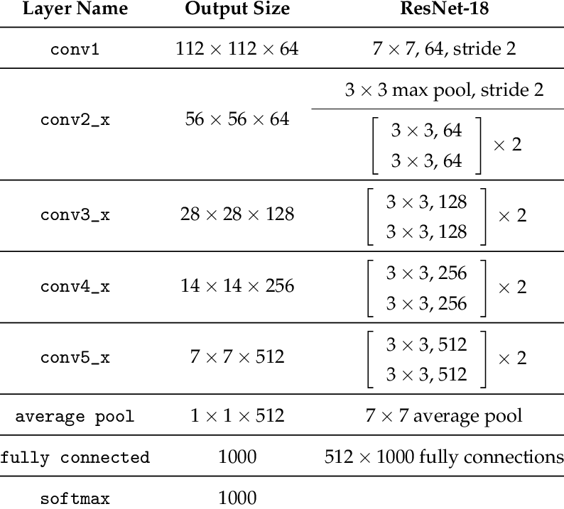
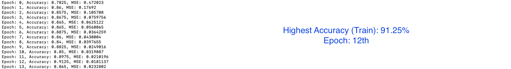

## Transfer Learning

Before we go ahead and discuss the **Why** question of Transfer Learning, let's have a look at **What is Transfer Learning?** Let's have a look at the <a href="http://cs231n.github.io/transfer-learning/">Notes</a> from CS231n on Transfer Learning:

```quote
In practice, very few people train an entire Convolutional Network from scratch (with random initialization), because it is relatively rare to have a dataset of sufficient size. Instead, it is common to pretrain a ConvNet on a very large dataset (e.g. ImageNet, which contains 1.2 million images with 1000 categories), and then use the ConvNet either as an initialization or a fixed feature extractor for the task of interest.
```

There are 3 scenarios possible:

1. When the data you have is similar (but not enough) to data trained on pre-trained model: Take an example of a pre-trained model trained on ImageNet dataset (containing 1000 classes). And the data we have has Dogs and Cats classes. Fortunate enough, ImageNet has some of the classes of Dog and Cat breeds and thus the model must have learned important features from the data. Let's say we don't have enough data but since the data is similar to the breeds in the ImageNet data set, we can simply use the ConvNet (except the last FC layer) to extract features from our dataset and train only the last Linear (FC) layer. We do this by the following code snippet in `Python`:

```python
from torchvision import models
# Download and load the pre-trained model
model = models.resnet18(pretrained=True)

# Set upgrading the gradients to False
for param in model.parameters():
	param.requires_grad = False

# Change the output features to the FC Layer and set it to upgrade gradients as True
resnet18.fc = torch.nn.Linear(512, 2)
for param in resnet18.fc.parameters():
	param.requires_grad = True
```

2. When you have enough data (and is similar to the data trained with pre-trained model): Then you might go for fine tuning the weights of all the layers in the network. This is largely due to the reason that we know we won't overfit because we have enough data.
3. Using pre-trained models might just be enough if you have the data which matches the classes in the original data set. 

Transfer Learning came into existence (the answer of **Why Transfer Learning?**) because of some major reasons, which include:

1. Lack of resources or data set to train a CNN. At times, we either don't have enough data or we don't have enough resources to train a CNN from scratch.
2. Random Initialization of weights vs Initialization of weights from the pre-trained model. Sometimes, it's just better to initialize weights from the pre-trained model (as it must have learned the generic features from it's data set) instead of randomly initializing the weights.

## Setting up the data with PyTorch C++ API

At every stage, we will compare the Python and C++ codes to do the same thing, to make the analogy easier and understandable. Starting with setting up the data we have. Note that we do have enough data and it is also similar to the original data set of ImageNet, but since I don't have enough resources to fine tune through the whole network, we perform Transfer Learning on the final FC layer only.

Starting with loading the dataset, as discussed in the blogs before, I'll just post a flow chart of procedure.

</img>

Once done, we can initialize the `CustomDataset` class:

**C++**

```cpp
std::vector<std::string> list_images; // list of images of Dogs and Cats, use load_data_from_folder function explained in previous blogs
std::vector<int> list_labels; // list of labels of the images
auto custom_dataset = CustomDataset(list_images, list_labes).map(torch::data::transforms::Stack<>());
```

**Python**

```python
from torchvision import datasets, transforms
import torch

folder_path = "/Users/krshrimali/Documents/dataset/train/"
transform = transforms.Compose([transforms.CenterCrop(224), transforms.ToTensor())
data = datasets.ImageFolder(root = os.path.join(folder_path), transform = transform)
```

We then use `RandomSampler` to make our data loader: (Note: it's important to use `RandomSampler` as we load the images sequentially and we want mixture of images in each batch of data passed to the network in an epoch)

**C++**

```cpp
int batch_size = 4;
auto data_loader = torch::data::make_data_loader<torch::data::samplers::RandomSampler>(std::move(custom_dataset), batch_size);
```

**Python**

```python
batch_size = 4
data_loader = torch.utils.data.DataLoader(dataset=data, batch_size = batch_size, shuffle = True)
```

## Loading the pre-trained model

The steps to load the pre-trained model and perform Transfer Learning are listed below:

1. Download the pre-trained model of ResNet18.
2. Load pre-trained model.
3. Change output features of the final FC layer of the model loaded. (Number of classes would change from 1000 - ImageNet to 2 - Dogs vs Cats).
4. Define optimizer on parameters from the final FC layer to be trained.
5. Train the FC layer on Dogs vs Cats dataset
5. Save the model (#TODO)

Let's go step by step.

**Step-1**: Download the pre-trained model of ResNet18

Currently, PyTorch C++ API doesn't have models incooperated to their API (like Python API has). But it's alright, the PyTorch developers have worked hard in developing `torch.jit` module which is also available in C++ API. Let's see how we do that.

First we donwload the pre-trained model and save it in the form of `torch.jit.trace` format to our local drive. 

```python
# Reference: #TODO- Add Link
from torchvision import models
# Download and load the pre-trained model
model = models.resnet18(pretrained=True)

# Set upgrading the gradients to False
for param in model.parameters():
	param.requires_grad = False

# Save the model except the final FC Layer
resnet18 = torch.nn.Sequential(*list(resnet18.children())[:-1])

example_input = torch.rand(1, 3, 224, 224)
script_module = torch.jit.trace(resnet18, example_input)
script_module.save('resnet18_without_last_layer.pt')
```

We will be using `resnet18_without_last_layer.pt` model file as our pre-trained model for transfer learning. 

**Step-2**: Load the pre-trained model

Let's go ahead and load the pre-trained model using `torch::jit` module. Note that the reason we have converted `torch.nn` to `torch.jit` type, is because C++ API currently does not support loading models of `torch.nn` modules.

**C++**:

```cpp
torch::jit::script::Module module;
module = torch::jit::load(argv[1]); // argv[1] should be the path to the model

// We need to convert last layer input and output features from (512, 1000) to (512, 2) since we only have 2 classes
torch::nn::Linear linear_layer(512, 2);

// Define the optimizer on parameters of linear_layer with learning_rate = 1e-3
torch::optim::Adam optimizer(linear_layer->parameters(), torch::optim::AdamOptions(1e-3))
```

**Python**:

```python
# We will directly load the torch.nn pre-trained model
model = models.resnet18(pretrained = True)

for param in model.parameters():
    param.requires_grad = False

model.fc = torch.nn.Linear(512, 2)
for param in model.fc.parameters():
	param.requires_grad = True

optimizer = torch.optim.Adam(model.fc.parameters())
cost = torch.nn.CrossEntropyLoss()
```

## Trainining the FC Layer

Let's first have a look at ResNet18 Network Architecture

Reference: https://www.researchgate.net/figure/ResNet-18-Architecture_tbl1_322476121</img>

The final step is to train the Fully Connected layer that we inserted at the end of the network (`linear_layer`). This one should be pretty straight forward, let's see how to do it.

**C++**:

```cpp
void train(torch::jit::script::Module net, torch::nn::Linear lin, Dataloader& data_loader, torch::optim::Optimizer& optimizer, size_t dataset_size) {
    /*
     This function trains the network on our data loader using optimizer for given number of epochs.
     
     Parameters
     ==================
     torch::jit::script::Module net: Pre-trained model
     torch::nn::Linear lin: Linear layer
     DataLoader& data_loader: Training data loader
     torch::optim::Optimizer& optimizer: Optimizer like Adam, SGD etc.
     size_t dataset_size: Size of training dataset
     */
    
    float batch_index = 0;
    
    for(int i=0; i<15; i++) {
        float mse = 0;
        float Acc = 0.0;
        
        for(auto& batch: *data_loader) {
            auto data = batch.data;
            auto target = batch.target.squeeze();
            
            // Should be of length: batch_size
            data = data.to(torch::kF32);
            target = target.to(torch::kInt64);
            
            std::vector<torch::jit::IValue> input;
            input.push_back(data);
            optimizer.zero_grad();

            auto output = net.forward(input).toTensor();
            // For transfer learning
            output = output.view({output.size(0), -1});

            output = lin(output);
            // Explicitly calculate torch::log_softmax of output from the FC Layer
            auto loss = torch::nll_loss(torch::log_softmax(output, 1), target);
           	
            loss.backward();
            optimizer.step();
            
            auto acc = output.argmax(1).eq(target).sum();

            Acc += acc.template item<float>();
            mse += loss.template item<float>();
            
            batch_index += 1;
        }
        
        mse = mse/float(batch_index); // Take mean of loss
        std::cout << "Epoch: " << i  << ", " << "Accuracy: " << Acc/dataset_size << ", " << "MSE: " << mse << std::endl;
        net.save("model.pt");
    }
}
```

**Python**:

```python
n_epochs = 15

for epoch in range(n_epochs):
    mse = 0.0
    acc = 0
    batch_index = 0

    for data in data_loader:
        batch_index += 1
        image, label = data
        
        optimizer.zero_grad()

        output = model(image)
        _, predicted_label = torch.max(output.data, 1)
        
        loss = cost(output, label)
        
        loss.backward()
        optimizer.step()

        mse += loss.item() # data[0]
        acc += torch.sum(predicted_label == label.data)
        if batch%5 == 0 and param == "train":
            print("Batch {}, Train Loss:{:.4f}, Train ACC:{:.4f}".format(
            batch, running_loss/(4*batch), 100*running_correct/(4*batch)))
    
    mse = mse/len(data)
    acc = 100*acc/len(data)
    
    print("Epoch: {}/{}, Loss: {:.4f}, Accuracy: {:.4f}".format(epoch+1, n_epochs, mse, acc))
```

The code to test should also not change much except the need of optimizer.

## Results

</img>

On a set of 400 images for training data, the maximum training Accuracy I could achieve was 91.25% in just less than 15 epochs. 